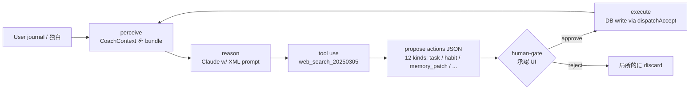

# Habit Design App

A personal Daily OS: morning journaling → AI coach reply → proposed tasks/habits as
approval cards → execution. Designed so a single user can hold planning, execution,
and reflection in one loop without rebuilding context each time.

*個人向け Daily OS。朝のジャーナル → AI コーチの応答 → 提案カード (タスク / 習慣) を承認 → 当日の実行 を 1 ループに収める設計。*

---

## What this demonstrates

- Built a production eval loop for Claude-based applications
- Designed replay-based prompt regression testing
- Integrated evals into GitHub Actions CI
- Measured **+9.4% quality improvement** from a one-line prompt change
- Applied **defense-in-depth guardrails** for probabilistic LLM behavior

The full design rationale is below; details on the eval system itself live in
[`docs/coach-eval/`](docs/coach-eval/README.md) and the extracted OSS framework
[claude-eval-kit](https://github.com/domyozi/claude-eval-kit).

---

## 🧭 Engineering Philosophy

> **"How do you combine probabilistic systems with deterministic ones?**
> **Answering this question well is essential to shipping AI that is actually trustworthy."**
>
> *(原文: 「確率論的なものと決定論的なものの組み合わせをいかに考えていくか。真に使えるAIを実装するためには、ここを考えることが非常に重要である」)*

Four positions that run through the whole repo:

1. **Design so the LLM breaking the rules is still safe.**
   In B2B AI work, low-probability failures occur. Code should not contain a layer that
   relies on the LLM behaving — the next layer must catch most cases the model misses.
2. **AI proposes, human decides.**
   Deterministic / pattern-based work goes to the AI. Creative work or anything with
   multiple valid answers stays with the human, who owns the goal. The AI silently
   rewriting a user's memory is treated as a serious UX failure, not a feature.
3. **Quality you cannot measure doesn't improve.**
   After watching a prompt edit improve one behavior and silently break another, manual
   review stopped being enough. So a custom LLM-as-judge eval pipeline was built and
   wired into CI to score every prompt PR automatically.
4. **Treat the unsettled parts as unsettled.**
   Thresholds (0.7 / 0.5), rubric dimensions, and guard heuristics are all in motion.
   They are not enshrined as best practice — they will be re-tuned as eval scores and
   acceptance rates accumulate.

The repo is the attempt to make this stance visible **as code**, not as text.

---

## 🎯 Portfolio highlight — LLM-as-judge 評価パイプライン

このリポジトリで最も力を入れた領域は **AI コーチ応答の評価システム**。

> 「LLM の応答品質を **数値で測定**し、prompt 改修の効果を CI で自動検出する」フルスタック実装。
> 1 行 prompt 改修で `avg 3.95 → 4.32 (+9.4%)` を実測し、CI で再現可能なループにした。

### 詳しいドキュメント

- 📄 **[docs/coach-eval/README.md](docs/coach-eval/README.md)** — 設計判断 (rubric, CoT, defense-in-depth)、アーキテクチャ、結果数値
- 🧰 **[claude-eval-kit](https://github.com/domyozi/claude-eval-kit)** — 上記システムを汎用化した別リポジトリ (MIT、~500 LOC、CI 統合済み)

> **A note on the judge model**: This pipeline uses Claude Haiku for both response
> generation and judging. Same-family judging has known limitations — fawning bias,
> shared blind spots, no independent verification. The kit is positioned as a
> **screening signal that reduces how often a human must review**, not as a replacement
> for human evaluation. Cross-model judging (Sonnet + Haiku ensemble) and human-judge
> agreement studies are explicit next steps.

### 関連コード (このリポジトリ内)

| ファイル | 役割 |
|---|---|
| [`backend/app/services/coach_prompts.py`](backend/app/services/coach_prompts.py) | 評価対象 = 本番 coach prompt (XML section 構造) |
| [`backend/app/services/coach_eval.py`](backend/app/services/coach_eval.py) | rubric / judge / sample / 永続化 |
| [`backend/app/services/coach_eval_replay.py`](backend/app/services/coach_eval_replay.py) | 同一 input → fresh AI 応答を生成して採点 |
| [`backend/app/services/coach_extractor.py`](backend/app/services/coach_extractor.py) | minimal-input ガード (defense-in-depth) |
| [`backend/app/api/routes/admin_eval.py`](backend/app/api/routes/admin_eval.py) | dashboard 用 admin API |
| [`backend/migrations/add_coach_eval_runs.sql`](backend/migrations/add_coach_eval_runs.sql) | 永続化スキーマ (RLS deny-by-default) |

---

## 🤖 Designed as a human-gated agent

Coach は「自律 AI」ではなく、**perceive → reason → tool → propose → human-gate → execute** の loop で動く。
完全自律にしなかった理由は意識的に: AI を「決定者」ではなく「提案者」に留めることで、ユーザーが自分のタスクと習慣に **責任を持つ感覚** を残す。



### Tool boundary — what the AI can read vs write

The boundary between "AI can observe" and "AI can change" runs through the approval
UI. The AI has wide read access but **no direct write path** to user state.

```mermaid
flowchart LR
  subgraph READ["🔍 AI read scope (no gate)"]
    direction TB
    R1[journal_entries]
    R2[CoachUserContext<br/>identity / patterns / profile]
    R2b[active_habits]
    R3[today_calendar via GCal]
    R4[pending_coach_actions]
  end
  subgraph PROPOSE["📝 AI propose scope (JSON only)"]
    direction TB
    P1[tasks / habits / goals]
    P2[memory_patch + confirmation]
    P3[task_deletes + confirmation]
    P4[primary_target]
  end
  subgraph GATE["🛡️ Human gate"]
    direction TB
    G1[approval card UI]
    G2[confirmation_prompts<br/>for destructive]
    G3[circuit breaker<br/>for minimal input]
  end
  subgraph EXEC["✅ Write scope (post-approval only)"]
    direction TB
    E1[Supabase row insert / update / delete]
    E2[coach_pending_actions audit log]
  end
  READ --> PROPOSE
  PROPOSE --> GATE
  GATE -->|approve| EXEC
  GATE -->|reject| DISCARD[discarded, audit logged]
```



The audit trail (`coach_pending_actions`) means **every proposed action is recorded
whether the user accepted or rejected it** — useful both for eval (accept-rate metrics)
and for post-hoc investigation if a write event ever needs to be reconstructed.

### Scope of autonomy

ゲートの判断軸は **hybrid** で運用:

| 判定軸 | 動作 |
|---|---|
| **明示的指示あり** (例: 「これタスクにして」) | gate なし、直接実行 |
| **AI 確信度 ≥ 0.7 + 言及あり** | `memory_patch` 直適用 |
| **0.5 ≤ confidence < 0.7** | `memory_patch` + `confirmation_prompts` (memory_overwrite) を**同時に** emit、UI で承認/却下 |
| **confidence < 0.5** | 何も emit しない (推奨レベルに達しない) |
| **「OK」「test」等 minimal input** | **circuit breaker** で全 action を strip (defense in depth、後述) |

このグラデーションは「**おせっかい / 強制感**」を避けつつ、「**ある程度コーチとしての役割や vector を持たせる**」バランスのため。

### Why human-gate (developer note)

> From a regular user's perspective, having memory rewritten without warning would
> be a reason to **stop trusting the product**. Trust, security robustness, and the
> meaning of **"AI that is actually usable"** — when you weigh these, the approval UI
> stops being optional.
>
> *(原文: 「他ユーザー視点で勝手にメモリ情報が書き換わることに恐怖を感じて利用しなくなるリスクを考えた。信頼性やセキュリティの堅牢性、そして『使える AI』という部分に重きを置いた際に、こうした承認 UI の必要性を感じている」)*

---

## 🛡️ Production reality checklist

LLM アプリは「動く」だけでなく「**ルールに従わなかった時でも安全**」が要件。
以下、既存実装の根拠ファイル一覧。

| 項目 | 状態 | 場所 / 根拠 |
|---|---|---|
| **Tracing (request_id)** | ✅ | [`ai_service.py:108,195`](backend/app/services/ai_service.py) — Anthropic response.id をログに残す |
| **Per-call cost tracking** | ✅ | [`claude_pricing.py`](backend/app/services/claude_pricing.py) + [`claude_logger.py:58`](backend/app/services/claude_logger.py) — モデル別単価 dict で USD 計算 |
| **Observability (structured logs)** | ✅ | [`claude_api_logs`](backend/migrations/add_claude_api_logs.sql) テーブル — feature / status / error_kind / latency_ms / cost を全 call 記録 |
| **Graceful cancellation** | ✅ | [`ai_service.py:186-191`](backend/app/services/ai_service.py) — `asyncio.CancelledError` を catch、partial usage 保存 |
| **Prompt injection defense** | ✅ | [`coach_prompts.py:711-713`](backend/app/services/coach_prompts.py) — `<user_input>` 内の `&<>` を XML エスケープ |
| **Degraded mode** | ✅ | [`voice_input.py:88-109`](backend/app/api/routes/voice_input.py) — AIUnavailableError → 503、通常トラッキングは継続可能 |
| **Defense-in-depth (input guard)** | ✅ | prompt 層 (output_contract.0-PRE) + backend 層 ([`coach_extractor.py`](backend/app/services/coach_extractor.py) `filter_by_user_input`) の二重 |
| **Retry strategy** | 🟡 | Tier 2 で追加予定 (SDK-level `max_retries`) |
| **Request timeout** | 🟡 | Tier 2 で追加予定 (60s non-streaming / 120s streaming) |
| **Fallback model routing** | 🟡 | Tier 2 で追加予定 (Sonnet → Haiku on AIUnavailableError) |

> **Stance**: Keep a layer in code that does not trust the LLM's output. LLMs are
> probabilistic, so the goal is not "the rule will be followed" but "the system is
> safe when the rule isn't." This is not LLM-specific — it comes from B2B AI work
> where a single low-probability failure can propagate to the next team, then to
> external users / customers. In production at any scale, defense in depth is a
> requirement, not a polish.
>
> *(原文: 「AI の出力を信用しないレイヤーをコードに持つ。LLM は確率的なので "ルールに従う期待値" ではなく "ルールが破れても安全" を作る。… B2B AI 実装で繰り返し見てきた事実から来る。次の部署 / 対外・対顧客にまで影響が波及する production では、defense in depth は必須」)*

---

## 🐛 Failure cases observed

Each entry is a real failure that occurred during this project and shipped a fix
(or an explicit caveat). Keeping them visible is part of the engineering posture —
hiding the rough edges hides the reason the safeguards exist.

- **AI rewriting user-deleted memory.** I had reviewed several AI-suggested memory
  updates and accepted them, then noticed a few entries I didn't want kept in my profile
  and manually deleted them. Later, during eval testing, I sent a few short turns like
  `OK` or `いいね` — and the AI suggested **putting that exact deleted information
  back, in its pre-edit form.** The first feeling wasn't "UX bug"; it was **"is the
  AI trying to force this on me? Can I actually trust this?"** Then the second-order
  thought: this is fine when it's just me, but I'm starting MVP testing with my wife
  and close friends — the moment one of them thinks "this is creepy," that AI is done.
  Convenience comes after trust; an AI that surfaces things the user wanted kept
  private or removed crosses a line that, in my view, must be defended absolutely.
  → Fixed via `memory_patch` confidence gating (≥0.7 direct, 0.5–0.7 confirmation,
  <0.5 no-op) **plus** an explicit-mention requirement (no update unless the field
  is mentioned in this turn). Root cause: a rule that *was* in the 700-line prompt
  asking the model to stay short on short inputs had been buried somewhere in the
  middle, and the model couldn't keep it in focus.

  > *(原文の要約: 「今回指示やコメントをした内容とは無関係なことについて、AIが急にサジェストを投げかけてきた際、不安や恐怖感を抱いた … 自分自身でメモリを許可し更新した際、その情報の中に『プロフィールとしては載せたくない』と思うものがあり、後から手動で修正・削除した。しかし、その後にLLM as Judgeのタイミングで『OK』『いいね』と反応したところ、先ほど手動で削除したはずの情報を、わざわざ改修前の状態で推奨してきた。『AIが自分にこれを強要しようとしているのではないか』『本当に信頼していいのか』という強い疑念に繋がった。… 他のユーザーに使ってもらうとなると話は別で、現在 MVP として妻や旧友たちに使ってもらい始めているが、『気味が悪い』と思われた瞬間にそのAIは絶対に使われなくなる。便利さ以前に、信頼性・セキュリティの欠如は絶対に守られなければならないライン」)*

- **Speculative action storm on minimal input.** During morning journaling — just
  writing thoughts and reflections — the AI returned about **ten proposal cards at
  once**. That volume is hard for anyone to process, and there's no way to actually
  review all of them during a busy morning. It becomes ritual without meaning:
  users will start tapping "approve" or "ignore" by reflex, defeating the purpose of
  the human gate entirely. Saying `OK!` produced 4 unrelated proposal cards in the
  same class of failure. → Fixed by a circuit breaker promoted to **the very top
  of `output_contract`** (prompt layer) + a backend `filter_by_user_input` that
  strips all actions when input is minimal (defense in depth, two layers).

  > *(原文の要約: 「朝のジャーナリングとして自分が考えていることや振り返りを書いている最中に、一気に10件ほどの推奨カードが出てきたこともあった。そもそも人間的に受け入れがたい量で、忙しい朝にすべてに目を通すのは形骸化を招く」)*
- **Rule buried in a 700-line prompt.** "Don't reply long to short inputs" existed on
  line 359 of the prompt but the model ignored it. → Highlighted by eval as a worst-case
  pattern, leading to the circuit-breaker promotion above. The lesson: prompt length is
  a quality risk in itself.
- **Confidence threshold drift (0.6 → 0.7).** The original `≥0.6` auto-apply threshold
  was too aggressive — users felt the AI was "changing things without asking." Lowered
  to 0.7, still considered unsettled and to be re-tuned with eval / accept-rate data.
- **Tone regression as a side effect.** Adding "concreteness" rules improved specificity
  (+1.28) and actionability (+1.43) but tone_fit dropped (−0.14). Below the fail
  threshold, but the regression was made visible by CI — the kind of trade-off that
  would silently slip past code review otherwise.
- **`coach_pending_actions` FK constraint on judge logging.** The eval used a synthetic
  user_id for `claude_api_logs`, which failed the FK on `auth.users` and crashed the
  log write. → Switched to passing the real per-pair user_id, log writes preserved,
  cost attribution remained per-real-user.
- **`postgrest` 2.x lacking `nulls_first` broke the admin eval detail endpoint.** The
  initial implementation used `.order(total, nulls_first=False)`; postgrest-py 2.x
  raised `TypeError` and the endpoint returned a 500 without CORS headers (the front
  saw "Failed to fetch"). → Moved sort to Python after fetch. The bigger lesson: an
  unhandled exception bypasses the CORS middleware and disguises the actual error.

---

## 構成

```
habit-design-app/
├── frontend-v3/   ← 現行フロントエンド (React 19 + Vite + TS)
├── backend/       ← FastAPI + Anthropic + Supabase
├── docs/
│   ├── coach-eval/   ← LLM-as-judge eval の portfolio writeup
│   └── design/
└── archive/       ← 旧バージョン (参照不要)
```

`frontend-v3` 以外のフロントは archived 扱いで現行開発の対象外。

## 技術スタック

| Layer | Stack |
|---|---|
| Frontend | React 19 + Vite + TypeScript + Tailwind CSS |
| Backend | FastAPI (Python 3.12) + Anthropic SDK (direct, no LangChain) |
| DB / Auth | Supabase (Postgres + Auth + Storage) |
| Hosting | Vercel (FE) + Railway (BE) |
| External | Google Calendar API, Anthropic Claude (Haiku / Sonnet) |
| Eval | claude-eval-kit (LLM-as-judge, GitHub Actions CI) |

---

## 主な設計判断 (面接で語れるポイント)

### 1. LangChain を採用しない

検討した上で見送り。**判断軸 2 つ**:

1. **構成の柔軟性と依存性の排除** — 自前の `CoachUserContext` (identity / patterns / values_keywords / insights / profile) を LangChain の generic memory に紐付ける手間 + deploy size の依存性を断ち切ることを考慮。LangChain を入れる正当化が見つからなかった。
2. **公式 SDK の動向** — Anthropic 公式 Cookbook も SDK 直叩きの例が増加。直叩きが現代の idiomatic な構成。

将来 RAG (vector retrieval over journals) を入れる局面で再検討する余地は残している。

### 2. Defense in depth — 単層ではなく 2 層 (prompt + backend)

**失敗観察**: 700+ 行の prompt の中に「短い入力では JSON を出さない」というルールが書いてあったのに、AI は守らなかった。「OK!」 1 つで 4 件の提案 + memory_patch.profile を勝手に書き換える事故が複数回。

→ **prompt 層に circuit breaker (output_contract の最上段)** + **backend 層に post-filter (`filter_by_user_input`)** の二重防御。
prompt が万一破れても backend で確実に止まる。

### 3. memory_patch policy — 確信度 3 段階 + 明示的言及ゲート

`profile` (年齢/家族構成等) を AI が勝手に書き換える事故 — 特に「ユーザーが意図的に消した属性」が再生成される UX 障害は重大。

3 段階の確信度ゲート + 「**今回の独白テキスト内に該当属性の明示的な言及がある場合のみ**」という言及ゲートで防止。

> **iteration history**: 当初 `≥0.6` で確信ゲートを設けていたが、自動適用が強すぎたため `0.7` に下げた。
> このような閾値調整は **eval スコア + 提案 accept 率** が見えていれば data-driven に回せる。
> 今後、規模が増えたタイミングで再調整予定。

### 4. モバイル PWA は分離設計

モバイル UX は別レイヤー (= 別リポジトリ [BusyBoy2](https://github.com/domyozi/BusyBoy2)) に切り出し。同じ backend を共有。
HealthKit / 歩数連携などのネイティブ統合は Swift / Kotlin で書く可能性も残しており、その方針検討中。

---

## ローカル開発

### Frontend (frontend-v3)

```bash
cd frontend-v3
npm install
cp .env.example .env.local
# .env.local に VITE_API_BASE_URL=http://localhost:8000 を設定
npm run dev
```

### Backend

```bash
cd backend
python3.12 -m venv .venv
source .venv/bin/activate
pip install -r requirements.txt
cp .env.example .env
# .env に Supabase / Anthropic / Google OAuth キーを設定
uvicorn app.main:app --reload
```

### Eval を走らせる

```bash
cd backend
source .venv/bin/activate

# 過去 journal から N 件採点
python scripts/run_coach_eval.py --limit 30 --label baseline --save-to-db

# fixture (固定 user_input) を現 prompt で再生成して採点
python scripts/run_coach_eval_replay.py \
  --fixture tests/fixtures/coach_eval_pairs.json \
  --label "after-fix" \
  --baseline tests/fixtures/coach_eval_baseline.json
```

---

## License

個人開発プロジェクト。コードは公開していますが現状ライセンス未定。
コードの一部 (LLM-as-judge framework) は MIT で [claude-eval-kit](https://github.com/domyozi/claude-eval-kit) として別途公開しています。

## Contact

プライバシー / データ削除に関するご質問: `vektojp@gmail.com`
