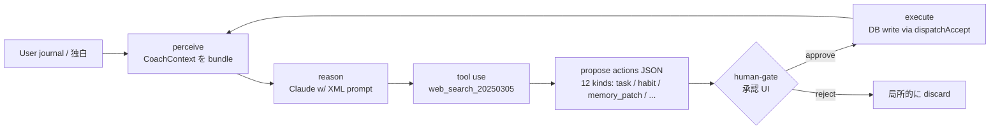

# Habit Design App

「未来の自分から逆算して習慣を設計し、トラッキングする」個人向け Daily OS。
朝のジャーナル → AI コーチの応答 → 提案カード (タスク / 習慣) を承認 → 当日の実行へ、を 1 ループに収める設計。

---

## 🧭 Engineering Philosophy

> **「確率論的なものと決定論的なものの組み合わせをいかに考えていくか。**
> **真に使えるAIを実装するためには、ここを考えることが非常に重要である」**

このリポジトリ全体に通底する設計姿勢を 4 行でまとめると:

1. **LLM はルールに従う期待ではなく、ルールが破れても安全に動く設計をする**
   B2B AI 実装で学んだ事実 — 確率の低い事象は必ず引かれる。LLM 出力を信用するレイヤーをコードに作らない。
2. **AI は提案者、人間は決定者**
   決定論的・パターン化された作業は AI に任せる。クリエイティブな思考や複数解のあるものは、人間がゴールを握る。
   AI が勝手にユーザーの過去メモリを書き換えるような挙動は、UX 上の重大事故として扱う。
3. **品質は測れない限り改善されない**
   prompt 改修で「一部改善 / 他方劣化」が起きた経験から、目視レビューの限界に到達。
   LLM-as-judge を自作し、CI に組んで PR ごとに自動採点する状態を作った。
4. **未確定な部分を未確定として書く**
   閾値 (0.7 vs 0.5)、rubric 4 dim、ガード閾値などは試行錯誤の途中。
   "ベストプラクティス" として固定せず、`eval スコア + accept 率` で継続調整する。

このリポジトリは、上記の philosophy が "言葉" ではなくコードとして表れているかを見せる試み。

---

## 🎯 Portfolio highlight — LLM-as-judge 評価パイプライン

このリポジトリで最も力を入れた領域は **AI コーチ応答の評価システム**。

> 「LLM の応答品質を **数値で測定**し、prompt 改修の効果を CI で自動検出する」フルスタック実装。
> 1 行 prompt 改修で `avg 3.95 → 4.32 (+9.4%)` を実測し、CI で再現可能なループにした。

### 詳しいドキュメント

- 📄 **[docs/coach-eval/README.md](docs/coach-eval/README.md)** — 設計判断 (rubric, CoT, defense-in-depth)、アーキテクチャ、結果数値
- 🧰 **[claude-eval-kit](https://github.com/domyozi/claude-eval-kit)** — 上記システムを汎用化した別リポジトリ (MIT、~500 LOC、CI 統合済み)

### 関連コード (このリポジトリ内)

| ファイル | 役割 |
|---|---|
| [`backend/app/services/coach_prompts.py`](backend/app/services/coach_prompts.py) | 評価対象 = 本番 coach prompt (XML section 構造) |
| [`backend/app/services/coach_eval.py`](backend/app/services/coach_eval.py) | rubric / judge / sample / 永続化 |
| [`backend/app/services/coach_eval_replay.py`](backend/app/services/coach_eval_replay.py) | 同一 input → fresh AI 応答を生成して採点 |
| [`backend/app/services/coach_extractor.py`](backend/app/services/coach_extractor.py) | minimal-input ガード (defense-in-depth) |
| [`backend/app/api/routes/admin_eval.py`](backend/app/api/routes/admin_eval.py) | dashboard 用 admin API |
| [`backend/migrations/add_coach_eval_runs.sql`](backend/migrations/add_coach_eval_runs.sql) | 永続化スキーマ (RLS deny-by-default) |

---

## 🤖 Designed as a human-gated agent

Coach は「自律 AI」ではなく、**perceive → reason → tool → propose → human-gate → execute** の loop で動く。
完全自律にしなかった理由は意識的に: AI を「決定者」ではなく「提案者」に留めることで、ユーザーが自分のタスクと習慣に **責任を持つ感覚** を残す。



### Scope of autonomy

ゲートの判断軸は **hybrid** で運用:

| 判定軸 | 動作 |
|---|---|
| **明示的指示あり** (例: 「これタスクにして」) | gate なし、直接実行 |
| **AI 確信度 ≥ 0.7 + 言及あり** | `memory_patch` 直適用 |
| **0.5 ≤ confidence < 0.7** | `memory_patch` + `confirmation_prompts` (memory_overwrite) を**同時に** emit、UI で承認/却下 |
| **confidence < 0.5** | 何も emit しない (推奨レベルに達しない) |
| **「OK」「test」等 minimal input** | **circuit breaker** で全 action を strip (defense in depth、後述) |

このグラデーションは「**おせっかい / 強制感**」を避けつつ、「**ある程度コーチとしての役割や vector を持たせる**」バランスのため。

### Why human-gate (developer note)

> 「他ユーザー視点で勝手にメモリ情報が書き換わることに恐怖を感じて利用しなくなるリスクを考えた。
> 信頼性やセキュリティの堅牢性、そして『**使える AI**』という部分に重きを置いた際に、
> こうした承認 UI の必要性を感じている」

---

## 🛡️ Production reality checklist

LLM アプリは「動く」だけでなく「**ルールに従わなかった時でも安全**」が要件。
以下、既存実装の根拠ファイル一覧。

| 項目 | 状態 | 場所 / 根拠 |
|---|---|---|
| **Tracing (request_id)** | ✅ | [`ai_service.py:108,195`](backend/app/services/ai_service.py) — Anthropic response.id をログに残す |
| **Per-call cost tracking** | ✅ | [`claude_pricing.py`](backend/app/services/claude_pricing.py) + [`claude_logger.py:58`](backend/app/services/claude_logger.py) — モデル別単価 dict で USD 計算 |
| **Observability (structured logs)** | ✅ | [`claude_api_logs`](backend/migrations/add_claude_api_logs.sql) テーブル — feature / status / error_kind / latency_ms / cost を全 call 記録 |
| **Graceful cancellation** | ✅ | [`ai_service.py:186-191`](backend/app/services/ai_service.py) — `asyncio.CancelledError` を catch、partial usage 保存 |
| **Prompt injection defense** | ✅ | [`coach_prompts.py:711-713`](backend/app/services/coach_prompts.py) — `<user_input>` 内の `&<>` を XML エスケープ |
| **Degraded mode** | ✅ | [`voice_input.py:88-109`](backend/app/api/routes/voice_input.py) — AIUnavailableError → 503、通常トラッキングは継続可能 |
| **Defense-in-depth (input guard)** | ✅ | prompt 層 (output_contract.0-PRE) + backend 層 ([`coach_extractor.py`](backend/app/services/coach_extractor.py) `filter_by_user_input`) の二重 |
| **Retry strategy** | 🟡 | Tier 2 で追加予定 (SDK-level `max_retries`) |
| **Request timeout** | 🟡 | Tier 2 で追加予定 (60s non-streaming / 120s streaming) |
| **Fallback model routing** | 🟡 | Tier 2 で追加予定 (Sonnet → Haiku on AIUnavailableError) |

> **設計姿勢**: AI の出力を信用しないレイヤーをコードに持つ。LLM は確率的なので "ルールに従う期待値" ではなく "ルールが破れても安全" を作る。これは LLM 限定の話ではなく、自分が B2B AI 実装で繰り返し見てきた事実から来る。次の部署 / 対外・対顧客にまで影響が波及する production では、defense in depth は必須。

---

## 構成

```
habit-design-app/
├── frontend-v3/   ← 現行フロントエンド (React 19 + Vite + TS)
├── backend/       ← FastAPI + Anthropic + Supabase
├── docs/
│   ├── coach-eval/   ← LLM-as-judge eval の portfolio writeup
│   └── design/
└── archive/       ← 旧バージョン (参照不要)
```

`frontend-v3` 以外のフロントは archived 扱いで現行開発の対象外。

## 技術スタック

| Layer | Stack |
|---|---|
| Frontend | React 19 + Vite + TypeScript + Tailwind CSS |
| Backend | FastAPI (Python 3.12) + Anthropic SDK (direct, no LangChain) |
| DB / Auth | Supabase (Postgres + Auth + Storage) |
| Hosting | Vercel (FE) + Railway (BE) |
| External | Google Calendar API, Anthropic Claude (Haiku / Sonnet) |
| Eval | claude-eval-kit (LLM-as-judge, GitHub Actions CI) |

---

## 主な設計判断 (面接で語れるポイント)

### 1. LangChain を採用しない

検討した上で見送り。**判断軸 2 つ**:

1. **構成の柔軟性と依存性の排除** — 自前の `CoachUserContext` (identity / patterns / values_keywords / insights / profile) を LangChain の generic memory に紐付ける手間 + deploy size の依存性を断ち切ることを考慮。LangChain を入れる正当化が見つからなかった。
2. **公式 SDK の動向** — Anthropic 公式 Cookbook も SDK 直叩きの例が増加。直叩きが現代の idiomatic な構成。

将来 RAG (vector retrieval over journals) を入れる局面で再検討する余地は残している。

### 2. Defense in depth — 単層ではなく 2 層 (prompt + backend)

**失敗観察**: 700+ 行の prompt の中に「短い入力では JSON を出さない」というルールが書いてあったのに、AI は守らなかった。「OK!」 1 つで 4 件の提案 + memory_patch.profile を勝手に書き換える事故が複数回。

→ **prompt 層に circuit breaker (output_contract の最上段)** + **backend 層に post-filter (`filter_by_user_input`)** の二重防御。
prompt が万一破れても backend で確実に止まる。

### 3. memory_patch policy — 確信度 3 段階 + 明示的言及ゲート

`profile` (年齢/家族構成等) を AI が勝手に書き換える事故 — 特に「ユーザーが意図的に消した属性」が再生成される UX 障害は重大。

3 段階の確信度ゲート + 「**今回の独白テキスト内に該当属性の明示的な言及がある場合のみ**」という言及ゲートで防止。

> **iteration history**: 当初 `≥0.6` で確信ゲートを設けていたが、自動適用が強すぎたため `0.7` に下げた。
> このような閾値調整は **eval スコア + 提案 accept 率** が見えていれば data-driven に回せる。
> 今後、規模が増えたタイミングで再調整予定。

### 4. モバイル PWA は分離設計

モバイル UX は別レイヤー (= 別リポジトリ [BusyBoy2](https://github.com/domyozi/BusyBoy2)) に切り出し。同じ backend を共有。
HealthKit / 歩数連携などのネイティブ統合は Swift / Kotlin で書く可能性も残しており、その方針検討中。

---

## ローカル開発

### Frontend (frontend-v3)

```bash
cd frontend-v3
npm install
cp .env.example .env.local
# .env.local に VITE_API_BASE_URL=http://localhost:8000 を設定
npm run dev
```

### Backend

```bash
cd backend
python3.12 -m venv .venv
source .venv/bin/activate
pip install -r requirements.txt
cp .env.example .env
# .env に Supabase / Anthropic / Google OAuth キーを設定
uvicorn app.main:app --reload
```

### Eval を走らせる

```bash
cd backend
source .venv/bin/activate

# 過去 journal から N 件採点
python scripts/run_coach_eval.py --limit 30 --label baseline --save-to-db

# fixture (固定 user_input) を現 prompt で再生成して採点
python scripts/run_coach_eval_replay.py \
  --fixture tests/fixtures/coach_eval_pairs.json \
  --label "after-fix" \
  --baseline tests/fixtures/coach_eval_baseline.json
```

---

## License

個人開発プロジェクト。コードは公開していますが現状ライセンス未定。
コードの一部 (LLM-as-judge framework) は MIT で [claude-eval-kit](https://github.com/domyozi/claude-eval-kit) として別途公開しています。

## Contact

プライバシー / データ削除に関するご質問: `vektojp@gmail.com`
