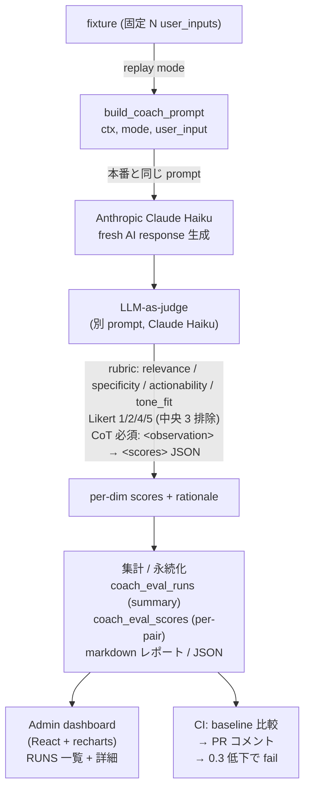

# Coach Eval — LLM-as-judge 評価パイプライン

AI コーチ応答の品質を **再現可能な数値** で測定し、prompt 改修の効果を CI で自動検出する評価システム。

> **本実装の意義**: LLM 応用機能は出力が確率的なため、目視レビューだけでは品質変化を捕捉できない。
> 本パイプラインで `(user_input, AI_response)` を rubric 採点 → 改修前後で平均 +9.4% (3.95 → 4.32) の改善を確認、
> CI 連携で「prompt PR の自動判定」までを完結させた。

---

## 結果サマリ (3 文)

- **数値改善**: `avg_total 3.95 → 4.32 (+9.4%)`、`specificity +34%` を 1 行 prompt 改修で達成
- **失敗例の自動抽出**: worst examples で「memory 過剰参照」「minimal input での hallucination」を特定 → defense-in-depth guard で再発防止
- **CI 自動化**: prompt PR で eval が走り、baseline 比 0.3 以上低下で workflow が fail (GitHub Actions + PR コメント)

---

## アーキテクチャ



---

## なぜ LangChain / LangGraph を使わなかったか

検討した上で **採用せず**。理由:

1. **既存実装が十分 idiomatic**: backend は `anthropic.AsyncAnthropic` を直接使う構成で、Anthropic 公式 cookbook の最新例とほぼ同じ。LangChain を挟むと薄い adapter 層が増えるだけ。
2. **Memory system は domain-specific の方が強い**: 既に `CoachUserContext` (identity / patterns / values_keywords / insights / goal_summary / profile) を AI が `memory_patch` で構造的に更新する仕組みがあり、LangChain の generic memory より表現力が高い。
3. **portfolio として "library を使える" より "同等のものを設計できる" の方が評価される**: 本実装は LangChain の Eval Chain と機能的に対等。

ただし将来 RAG (過去 journal 全文の意味検索) を入れるなら `pgvector` + 自作 retriever か LangChain `VectorStoreRetriever` の二択を再検討する余地は残している。

---

## Rubric 設計のポイント

```python
# coach_eval.py
RUBRIC = [
    {"key": "relevance",     "label": "関連性",       ...},  # 核心の論点に応答してるか
    {"key": "specificity",   "label": "具体性",       ...},  # 数値 / 期限が含まれるか
    {"key": "actionability", "label": "実行可能性",   ...},  # 今日〜明日に実行できるか
    {"key": "tone_fit",      "label": "口調適合",     ...},  # 説教 / 媚びてないか
]
```

設計判断:

- **5 段階ではなく 1/2/4/5 の binary-skewed scale**: 真ん中の 3 を抜くことで、判定モデルが「迷ったら 3」と中央値逃避するのを防ぐ。"どちらかと言うと良い/悪い" を強制する。
- **Anchor 例文を rubric に embed**: 各スコアに「これに該当する応答」の例文を 1 行つけてモデル間の解釈ブレを抑制。
- **CoT を XML タグで強制**: 採点前に `<observation>` で論点を 1〜2 行抽出させ、その後 `<scores>` で JSON。後追いで rationale を読めるようにする。

---

## Defense-in-depth ガード (実運用で得た学び)

baseline 採点で worst examples を見たところ、特定パターンが繰り返し低スコアを取った:

> **観察**: ユーザー入力が「OK!」「test」などの相槌だけのとき、AI が無関係な context を引っ張ってきて 4 件の提案を出し、しかも `memory_patch.profile` をユーザーが意図的に消した情報で上書きしてくる。

`prompt` 内のルール (700+ 行) には既に `"純粋な相槌では JSON を出さない"` の記述があったが守られず。原因:

1. **ルールが長文の中で埋もれる** — 700 行の中の 1 行は AI の attention で軽視される
2. **スキーマが filled state を rewards** — AI は「役立つ = フィールドを埋める」と学習しがち

対策として 2 層で防御 (defense in depth):

### 層 1: Prompt の最上段に Circuit Breaker

```
0-PRE. **必ず最初に判定し、該当したら ANY action を出さない**:
  - 30 字未満の短い入力
  - 「OK」「うん」「了解」等の単純な相槌・確認のみ
  - 「test」「あ」等の意味のない / テスト入力
→ tasks / habits / memory_patch / confirmation_prompts すべて空。例外なし。
```

埋もれていたルールを最上段に格上げ + 具体例 + 理由 ("ユーザーが意図的に消した情報の復活防止") を明記。

### 層 2: Backend の post-filter

```python
# coach_extractor.py
def filter_by_user_input(payload, user_input):
    """minimal input なら全 action を剥がす circuit breaker。
    prompt 側ガードが破れた場合の二重防御。"""
    if _is_minimal_input(user_input):
        return {"followup_question": payload.get("followup_question")}
    return payload
```

prompt が万一破れても backend で確実に止まる。観測ログに `coach-stream minimal_input gate: actions dropped` を残して効いたか可視化。

> **設計思想**: AI の出力を信用しないレイヤーをコードに持つ。LLM は確率的なので "ルールに従う期待値" ではなく "ルールが破れても安全" を作る。

---

## CI 統合 (Phase C)

`coach_prompts.py` を変更した PR を出すと、GitHub Actions が以下を自動実行:

1. fixture (7 件の固定 user_input) を読み込み
2. **現在の prompt で fresh AI 応答を生成** (= 「同じ input への prompt 効果」を測る)
3. judge model で採点
4. baseline スコア (main branch 時点の固定値) と dimension 別比較
5. PR に markdown コメント (🟢🔴⚪ の Δ 表)
6. **任意 dimension が 0.3 以上低下したら workflow を fail**

PR コメント例:

```markdown
# Coach Eval — pr-42
- avg total: 4.10 / 5

## Baseline vs Current
| dimension | baseline | current | Δ |
|---|---|---|---|
| relevance     | 3.20 | 3.50 | 🟢 +0.30 |
| specificity   | 3.60 | 4.30 | 🟢 +0.70 |
| actionability | 3.40 | 3.50 | 🟢 +0.10 |
| tone_fit      | 5.00 | 4.80 | ⚪ -0.20 |
| **avg_total** | 3.80 | 4.10 | 🟢 +0.30 |
```

---

## ファイル構成 (コードを読む順)

| ファイル | 役割 |
|---|---|
| [`backend/app/services/coach_prompts.py`](../../backend/app/services/coach_prompts.py) | 採点対象 = 本番 coach prompt 本体 |
| [`backend/app/services/coach_eval.py`](../../backend/app/services/coach_eval.py) | rubric / judge_pair / sample / persistence |
| [`backend/app/services/coach_eval_replay.py`](../../backend/app/services/coach_eval_replay.py) | 同一 input で fresh 応答を作る replay mode |
| [`backend/scripts/run_coach_eval.py`](../../backend/scripts/run_coach_eval.py) | 過去 journal を採点する CLI |
| [`backend/scripts/run_coach_eval_replay.py`](../../backend/scripts/run_coach_eval_replay.py) | CI 用 replay CLI (baseline 比較 + regression 検出) |
| [`backend/app/api/routes/admin_eval.py`](../../backend/app/api/routes/admin_eval.py) | dashboard 用 admin API |
| [`backend/app/services/coach_extractor.py`](../../backend/app/services/coach_extractor.py) | defense-in-depth backend filter |
| [`backend/migrations/add_coach_eval_runs.sql`](../../backend/migrations/add_coach_eval_runs.sql) | 永続化スキーマ |
| [`.github/workflows/coach-eval.yml`](../../.github/workflows/coach-eval.yml) | PR 自動採点 workflow |

---

## 既知の限界 / Next steps

- **judge model 自身も bias を持つ**: 同 family (Claude) で採点しているため fawning bias の可能性。Sonnet と Haiku の二重採点 + 相関係数で human eval との一致度を測る予定。
- **fixture が 7 件と少ない**: 100+ 件に拡張すると分散が安定する。production journal を anonymize した dataset を別途準備中。
- **Replay の context が固定 mock**: 実 context (個人 memory / habit) の影響は反映できない。本格化するなら "context permutation" eval を追加 (同じ input でも memory が違うと AI 応答がどう変わるか)。
- **コスト**: 7 件 * judge ($0.003) ≈ $0.02/run。10倍に拡張しても CI 1 回 $0.2 程度。

---

## 採用面接で語れる Talk Points

- LLM eval pipeline をフルスタックで設計・実装 (rubric, judge, persistence, CI)
- 確率的な AI 出力の品質を **数値化** することで、改善ループを機械的に回せる状態を作った
- defense in depth の設計判断 (LLM を信用しないレイヤー)
- LangChain を **使わない判断** を理由付きで説明できる
- 1 行 prompt 改修で +1.17 (specificity) を実測 — eval が無ければ "なんとなく良くなった" で終わっていた
