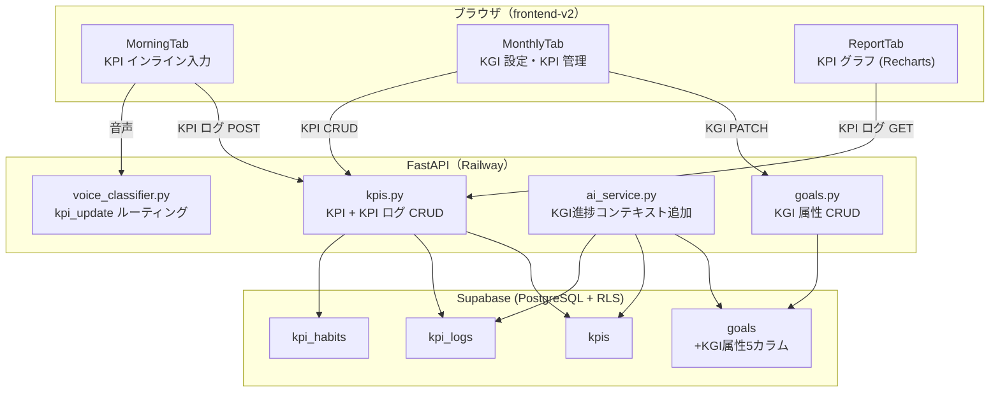

# KPI/KGI ゴール逆算トラッキング アーキテクチャ設計

**作成日**: 2026-04-15
**関連要件定義**: [requirements.md](../../spec/goal-kpi-tracking/requirements.md)
**ヒアリング記録**: [design-interview.md](design-interview.md)

**【信頼性レベル凡例】**:
- 🔵 **青信号**: EARS要件定義書・設計文書・ユーザヒアリングを参考にした確実な設計
- 🟡 **黄信号**: EARS要件定義書・設計文書・ユーザヒアリングから妥当な推測による設計
- 🔴 **赤信号**: EARS要件定義書・設計文書・ユーザヒアリングにない推測による設計

---

## システム概要 🔵

**信頼性**: 🔵 *要件定義書・プロダクト思想文書より*

既存の `WannaBe → Goal → Habit` 3 段階構造を `WannaBe → KGI(Goal拡張) → KPI → Habit` の 4 段階カスケードへ拡張する。
既存テーブル（`goals`）へ KGI 属性（`target_value`, `unit`, `target_date`, `metric_type`）を追加し、
新規テーブル（`kpis`, `kpi_logs`, `kpi_habits`）を追加する。
グラフ描画には Recharts を使用する。

## アーキテクチャパターン 🔵

**信頼性**: 🔵 *既存アーキテクチャ設計より*

- **パターン**: 既存のレイヤードアーキテクチャ（FastAPI + React + Supabase）をそのまま拡張
- **変更方針**:
  - バックエンド: `goals` ルートの拡張 + 新規 `kpis` ルートの追加
  - フロントエンド: 既存の `Plan` 相当画面に KGI 設定 UI を追加、`Today` 画面に KPI 入力 UI を追加
  - DB: `goals` テーブルに nullable カラムを追加（後方互換性維持）

## コンポーネント構成

### フロントエンド (frontend-v2) 🔵

**信頼性**: 🔵 *既存 frontend-v2 実装探索・ヒアリングより*

| 要素 | 追加・変更内容 |
|------|--------------|
| グラフライブラリ | `recharts` を新規追加 |
| 型定義 | `frontend-v2/src/types/index.ts` に KPI 関連型を追加 |
| 新規コンポーネント | `KgiCard`, `KpiSection`, `KpiLogInput`, `KpiChart` |
| 変更コンポーネント | `MonthlyTab`（KGI設定 UI 追加）、`MorningTab`（KPI入力 UI 追加） |

### バックエンド 🔵

**信頼性**: 🔵 *既存 backend/ 実装探索より*

| 要素 | 追加・変更内容 |
|------|--------------|
| 変更ルート | `backend/app/api/routes/goals.py` に KGI 属性の CRUD を追加 |
| 新規ルート | `backend/app/api/routes/kpis.py`（KPI CRUD + KPI ログ CRUD） |
| 変更スキーマ | `backend/app/models/schemas.py` に KGI/KPI Pydantic モデルを追加 |
| 変更サービス | `backend/app/services/ai_service.py` に KGI 進捗コンテキストを追加 |
| 変更分類器 | `backend/app/services/voice_classifier.py` に `kpi_update` ルーティング追加 |

### データベース（Supabase PostgreSQL） 🔵

**信頼性**: 🔵 *要件定義 REQ-KGI-001・REQ-KPI-001・REQ-LOG-001 より*

| 変更種別 | 内容 |
|---------|------|
| 既存テーブル変更 | `goals` テーブルに 5 カラム追加（nullable、後方互換） |
| 新規テーブル | `kpis`（KPI 定義）、`kpi_logs`（日次記録）、`kpi_habits`（中間テーブル） |
| RLS | 3テーブル全てに `user_id` ベースの RLS を適用 |

---

## システム構成図 🔵

**信頼性**: 🔵 *既存アーキテクチャ設計より*



---

## ディレクトリ構造（変更箇所のみ） 🔵

**信頼性**: 🔵 *既存プロジェクト構造より*

```
backend/app/
├── api/routes/
│   ├── goals.py           ← KGI 属性 CRUD を追加
│   └── kpis.py            ← 新規追加
├── models/
│   └── schemas.py         ← KGI/KPI Pydantic モデルを追加
└── services/
    ├── ai_service.py      ← KGI 進捗コンテキストを追加
    └── voice_classifier.py ← kpi_update ルーティングを追加

frontend-v2/src/
├── types/
│   └── index.ts           ← KGI/KPI 型を追加
├── components/
│   ├── kpi/               ← 新規ディレクトリ
│   │   ├── KgiCard.tsx    ← KGI 進捗カード
│   │   ├── KpiSection.tsx ← 今日のKPI入力セクション
│   │   ├── KpiLogInput.tsx ← インライン値入力
│   │   └── KpiChart.tsx   ← 日次・週次・月次グラフ (Recharts)
│   └── tabs/
│       ├── MorningTab.tsx ← KPI入力 UI を追加
│       └── MonthlyTab.tsx ← KGI/KPI 管理 UI を追加
└── lib/
    └── api.ts             ← KGI/KPI API 呼び出し関数を追加
```

---

## 非機能要件の実現方法

### パフォーマンス 🟡

**信頼性**: 🟡 *NFR-KPI-001/002 から妥当な推測*

- **KPI ログ記録（2秒以内）**: TanStack Query の楽観的更新で即座に UI に反映し、バックグラウンドで保存
- **グラフ描画（3秒以内）**: 最大 90 日分のログのみクライアントに返却。サーバー側でウィンドウ集計

### セキュリティ 🔵

**信頼性**: 🔵 *NFR-KPI-101・既存セキュリティ設計より*

- **RLS**: 新規 3 テーブル全てに `auth.uid() = user_id` ポリシーを適用
- **AI 送信データ**: KPI タイトルは送信せず、`metric_type` と達成率のみを送信

### 後方互換性 🔵

**信頼性**: 🔵 *REQ-KGI-001 の設計方針より*

- `goals` テーブルの追加カラムは全て `NULL` を許容する
- `target_date IS NULL` の Goal は従来通りの動作（KGI ではない）

---

## 技術的制約

### 既存コード制約 🔵

**信頼性**: 🔵 *既存実装探索より*

- `goals` テーブルには現在「最大 3 件」の制約があるが、KGI 化されても件数制約はそのまま維持する
- `frontend-v2/src/types/index.ts` の既存型定義を壊さずに拡張する

### AI コスト制約 🔵

**信頼性**: 🔵 *プロダクト思想 §7.3・既存制約より*

- Claude API は「週次レビュー時の KGI 進捗コメント」のみで使用する
- KPI グラフ・進捗率計算はルールベースで行い、AI は呼ばない

---

## 関連文書

- **データフロー**: [dataflow.md](dataflow.md)
- **型定義**: [interfaces.ts](interfaces.ts)
- **DBスキーマ**: [database-schema.sql](database-schema.sql)
- **API仕様**: [api-endpoints.md](api-endpoints.md)
- **要件定義**: [requirements.md](../../spec/goal-kpi-tracking/requirements.md)

## 信頼性レベルサマリー

- 🔵 青信号: 15件 (79%)
- 🟡 黄信号: 4件 (21%)
- 🔴 赤信号: 0件 (0%)

**品質評価**: 高品質
