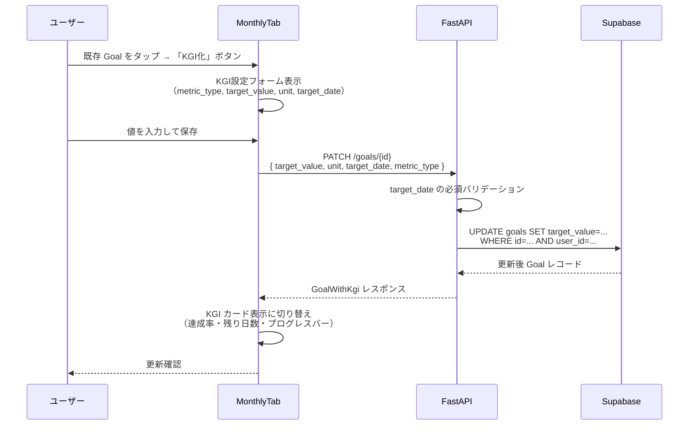
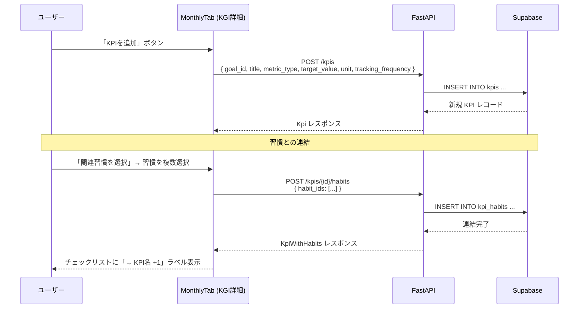
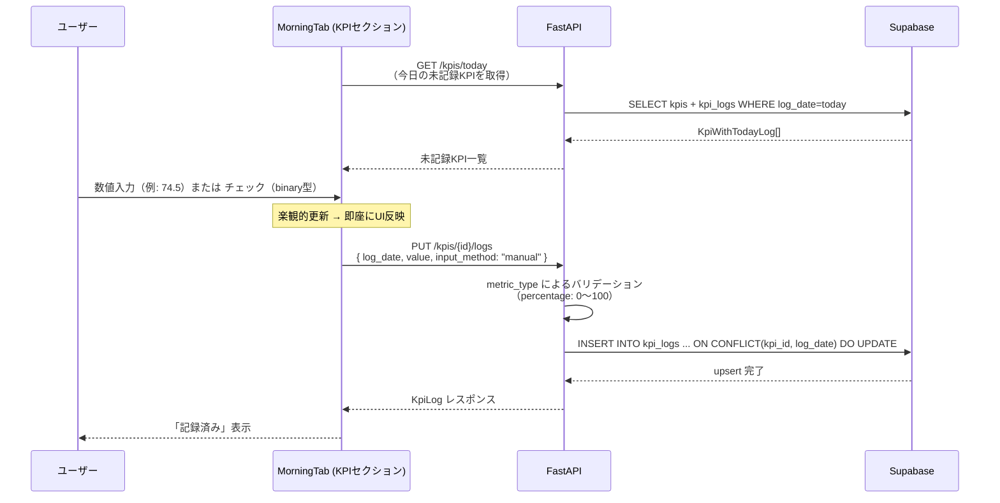
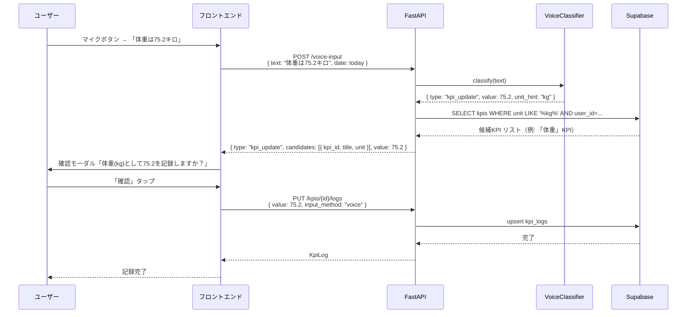
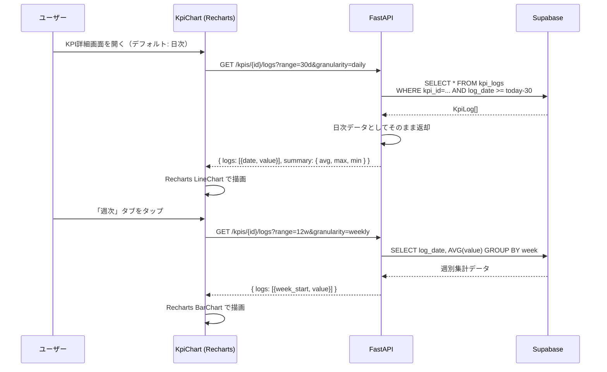
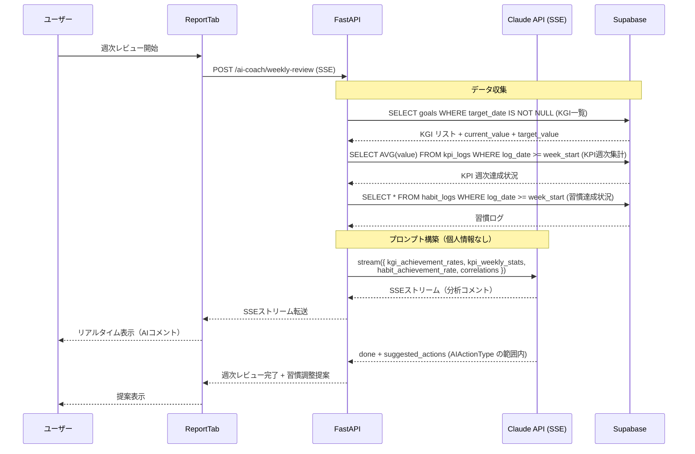
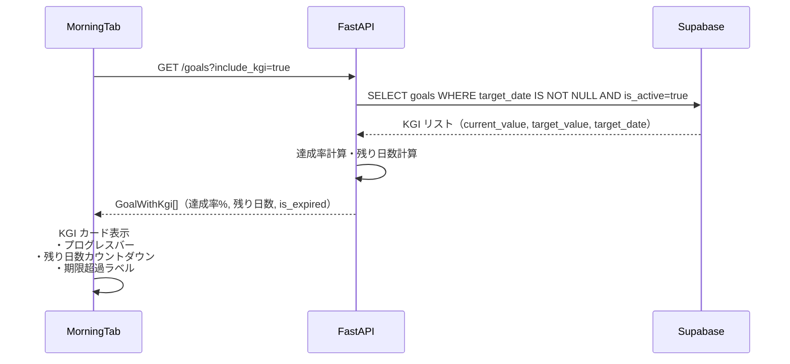

# KPI/KGI ゴール逆算トラッキング データフロー図

**作成日**: 2026-04-15
**関連アーキテクチャ**: [architecture.md](architecture.md)
**関連要件定義**: [requirements.md](../../spec/goal-kpi-tracking/requirements.md)

**【信頼性レベル凡例】**:
- 🔵 **青信号**: ヒアリング・要件定義書を参考にした確実なフロー
- 🟡 **黄信号**: 要件定義書から妥当な推測によるフロー

---

## 1. KGI の設定フロー 🔵

**信頼性**: 🔵 *REQ-KGI-001〜007 より*  
**関連ストーリー**: 1.1



---

## 2. KPI の作成と習慣連結フロー 🔵

**信頼性**: 🔵 *REQ-KPI-001〜007 より*  
**関連ストーリー**: 2.1, 2.2



---

## 3. KPI ログの手動記録フロー 🔵

**信頼性**: 🔵 *REQ-LOG-001・REQ-LOG-002・NFR-KPI-201 より*  
**関連ストーリー**: 3.1



---

## 4. KPI ログの音声記録フロー 🔵

**信頼性**: 🔵 *REQ-LOG-003・EDGE-KPI-006 より*  
**関連ストーリー**: 3.2



---

## 5. KPI グラフ表示フロー 🔵

**信頼性**: 🔵 *REQ-LOG-005 より*  
**関連ストーリー**: 4.2



---

## 6. 週次レビュー AI KGI 進捗コメントフロー 🔵

**信頼性**: 🔵 *REQ-REVIEW-001〜003 より*  
**関連ストーリー**: 5.1



---

## 7. ダッシュボード（今日）KGI サマリー表示フロー 🔵

**信頼性**: 🔵 *REQ-DASH-001〜003 より*  
**関連ストーリー**: 4.1



---

## エラーハンドリングフロー 🟡

**信頼性**: 🟡 *既存実装パターンから推測*

```mermaid
flowchart TD
    A[エラー発生] --> B{エラー種別}
    B -->|target_date 未入力| C[422: target_date は必須です]
    B -->|percentage 範囲外| D[422: 0〜100 の値を入力してください]
    B -->|他ユーザーのKPIへのアクセス| E[403: Forbidden RLSブロック]
    B -->|存在しないKPI| F[404: KPI not found]
    B -->|音声KPI単位不一致| G[200: candidates=[] → 確認モーダルスキップなし]

    C --> H[フロントエンドでエラー表示]
    D --> H
    E --> H
    F --> H
    G --> I[フロントエンドで手動KPI選択モーダル表示]
```

---

## 信頼性レベルサマリー

- 🔵 青信号: 7件 (88%)
- 🟡 黄信号: 1件 (12%)
- 🔴 赤信号: 0件 (0%)

**品質評価**: 高品質
