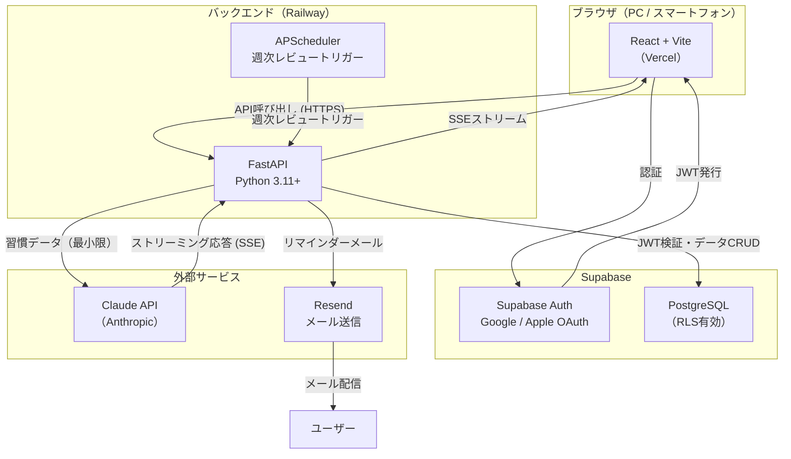

# 習慣設計アプリ アーキテクチャ設計

**作成日**: 2026-04-12
**関連要件定義**: [requirements.md](../../spec/habit-design-app/requirements.md)
**ヒアリング記録**: [design-interview.md](design-interview.md)

**【信頼性レベル凡例】**:
- 🔵 **青信号**: 要件定義書・ユーザーヒアリングを参考にした確実な設計
- 🟡 **黄信号**: 要件定義書・ユーザーヒアリングから妥当な推測による設計
- 🔴 **赤信号**: 要件定義書・ユーザーヒアリングにない推測による設計

---

## システム概要 🔵

**信頼性**: 🔵 *要件定義書概要・ヒアリングQ3より*

Python/FastAPI バックエンド + React/Vite フロントエンドの分離構成。
Supabase でDB・認証を一元管理し、Claude API をサーバーサイドのみから呼び出すセキュアな設計。
開発者のPython・Claude・MCP学習を兼ねることを意識したシンプルな構成とする。

## アーキテクチャパターン 🔵

**信頼性**: 🔵 *ヒアリング技術選定Q1-Q4より*

- **パターン**: レイヤードアーキテクチャ（フロントエンド分離型）
- **選択理由**:
  - Python学習目的から FastAPI バックエンドを独立させる
  - Claude APIキーをバックエンドのみに隔離（NFR-101）
  - フロントエンドは React + Vite のシンプルな SPA

---

## コンポーネント構成

### フロントエンド 🔵

**信頼性**: 🔵 *ヒアリング技術選定Q3より*

| 要素 | 採用技術 | 選定理由 |
|------|---------|---------|
| フレームワーク | React 18 + Vite | Python バックエンドとの分離構成に最適。高速な開発体験 |
| 言語 | TypeScript | 型安全性。共通型定義をバックエンドと共有可能 |
| スタイリング | Tailwind CSS | ユーティリティファーストで素早いUI実装。レスポンシブ対応が容易 |
| ルーティング | React Router v6 | SPA のルーティング標準 |
| サーバー状態管理 | TanStack Query (React Query) | API キャッシュ・ローディング状態管理が簡潔 |
| クライアント状態 | Zustand | 軽量なグローバルステート管理 |
| フォーム | React Hook Form | バリデーション含む入力フォーム管理 |
| Supabase クライアント | @supabase/supabase-js | 認証・リアルタイム |

### バックエンド 🔵

**信頼性**: 🔵 *ヒアリング技術選定Q1より*

| 要素 | 採用技術 | 選定理由 |
|------|---------|---------|
| フレームワーク | FastAPI | Python最速の非同期Webフレームワーク。自動OpenAPIドキュメント生成 |
| 言語 | Python 3.11+ | 学習目的。Claude Python SDK との親和性が高い |
| Claude連携 | anthropic SDK | 公式Python SDK。ストリーミング対応 |
| Supabase連携 | supabase-py | Python用Supabaseクライアント |
| 認証検証 | python-jose + Supabase JWT | Supabase発行JWTの検証 |
| メール送信 | resend | シンプルなトランザクションメールAPI |
| スケジューラー | APScheduler | 週次レビューのトリガー等 |
| 環境変数 | python-dotenv | 設定管理 |

### データベース・インフラ 🔵

**信頼性**: 🔵 *ヒアリング技術選定Q2より*

| 要素 | 採用技術 | 選定理由 |
|------|---------|---------|
| データベース | Supabase (PostgreSQL) | 無料枠あり。Google/Apple OAuth 内蔵。RLS でデータ分離が容易 |
| 認証 | Supabase Auth | Google・Apple ソーシャルログインを標準サポート（REQ-101/102） |
| ホスティング (FE) | Vercel | React + Vite との相性最良。CDN・HTTPS 自動設定 |
| ホスティング (BE) | Railway | Python/FastAPI のデプロイが容易。無料枠あり |

---

## システム構成図 🔵

**信頼性**: 🔵 *確定技術スタックより*



---

## ディレクトリ構造 🔵

**信頼性**: 🔵 *確定技術スタックより*

```
habit-design-app/
├── frontend/                    # React + Vite フロントエンド
│   ├── src/
│   │   ├── components/          # 再利用可能なUIコンポーネント
│   │   │   ├── ui/              # 基本UIパーツ（ボタン、モーダル等）
│   │   │   ├── habits/          # 習慣関連コンポーネント
│   │   │   ├── dashboard/       # ダッシュボード
│   │   │   └── ai/              # AIフィードバック表示
│   │   ├── pages/               # ルートページ
│   │   │   ├── Dashboard.tsx
│   │   │   ├── WannaBe.tsx
│   │   │   ├── WeeklyReview.tsx
│   │   │   └── Settings.tsx
│   │   ├── hooks/               # カスタムフック
│   │   ├── store/               # Zustandストア
│   │   ├── lib/                 # APIクライアント・ユーティリティ
│   │   │   ├── api.ts           # FastAPI呼び出し共通関数
│   │   │   └── supabase.ts      # Supabaseクライアント初期化
│   │   ├── types/               # TypeScript型定義
│   │   └── main.tsx
│   ├── public/
│   ├── index.html
│   ├── vite.config.ts
│   └── package.json
│
├── backend/                     # FastAPI バックエンド
│   ├── app/
│   │   ├── api/
│   │   │   └── routes/
│   │   │       ├── auth.py       # 認証検証ミドルウェア
│   │   │       ├── wanna_be.py   # Wanna Be CRUD
│   │   │       ├── habits.py     # 習慣 CRUD + ログ記録
│   │   │       ├── voice_input.py # 音声入力AI分類
│   │   │       ├── ai_coach.py   # AIフィードバック・週次レビュー
│   │   │       └── notifications.py # 通知設定
│   │   ├── core/
│   │   │   ├── config.py         # 設定（環境変数）
│   │   │   ├── security.py       # JWT検証
│   │   │   └── supabase.py       # Supabaseクライアント初期化
│   │   ├── services/
│   │   │   ├── ai_service.py     # Claude API連携（ストリーミング含む）
│   │   │   ├── voice_classifier.py # 音声入力意図分類
│   │   │   └── email_service.py  # Resend連携
│   │   ├── models/
│   │   │   └── schemas.py        # Pydanticモデル
│   │   └── main.py               # FastAPIエントリーポイント
│   ├── scheduler/
│   │   └── weekly_review.py      # APSchedulerジョブ定義
│   ├── requirements.txt
│   └── .env.example
│
└── docs/
    ├── spec/
    └── design/
```

---

## 非機能要件の実現方法

### パフォーマンス 🟡

**信頼性**: 🟡 *NFR-001/002から妥当な推測*

- **通常操作（NFR-001: 2秒以内）**: TanStack Query によるキャッシュ。FastAPI の非同期処理
- **AI応答（NFR-002: 30秒以内）**: Claude API ストリーミング + Server-Sent Events でユーザーに逐次表示

### セキュリティ 🔵

**信頼性**: 🔵 *NFR-101/102/103・要件定義より*

- **APIキー保護（NFR-101）**: Claude API キーは Railway の環境変数のみで管理。クライアントへの露出なし
- **データ分離（NFR-102）**: Supabase Row Level Security (RLS) でユーザーは自分のデータのみアクセス可能
- **HTTPS（NFR-103）**: Vercel・Railway ともに HTTPS 自動設定
- **認証フロー**: Supabase Auth が発行する JWT をバックエンドが検証。すべての API エンドポイントで認証必須

### スケーラビリティ 🟡

**信頼性**: 🟡 *学習・個人用プロジェクトのため最小限の考慮*

- 学習・個人プロジェクトフェーズでは水平スケーリングは不要
- Supabase・Railway の無料〜低料金プランでスタート

---

## 技術的制約

### セキュリティ制約 🔵

**信頼性**: 🔵 *NFR-101・ヒアリングQ3より*

- Claude API キーはサーバーサイドのみで保持（クライアントに一切露出しない）
- Supabase JWT 検証を全 API エンドポイントに適用（公開エンドポイント除く）
- RLS ポリシーで全テーブルのユーザー分離を強制

### AI処理制約 🔵

**信頼性**: 🔵 *REQ-303・REQ-605より*

- Claude API に送信するデータは習慣の達成パターン・統計情報のみ（氏名・メールアドレス等の個人情報は送信禁止）
- AI による習慣変更は「追加・削除・時間帯変更」の3種類のみ許可。フリーフォームな変更は禁止

### 音声入力制約 🟡

**信頼性**: 🟡 *REQ-401・NFR-201から推測*

- Web Speech API はChrome/Edgeのみ対応。Firefox・Safariは未対応
- MVPでは Web Speech API を使用し、対応ブラウザをドキュメントに明記

---

## 関連文書

- **データフロー**: [dataflow.md](dataflow.md)
- **型定義**: [interfaces.ts](interfaces.ts)
- **DBスキーマ**: [database-schema.sql](database-schema.sql)
- **API仕様**: [api-endpoints.md](api-endpoints.md)
- **要件定義**: [requirements.md](../../spec/habit-design-app/requirements.md)

## 信頼性レベルサマリー

- 🔵 青信号: 18件 (72%)
- 🟡 黄信号: 7件 (28%)
- 🔴 赤信号: 0件 (0%)

**品質評価**: 高品質
