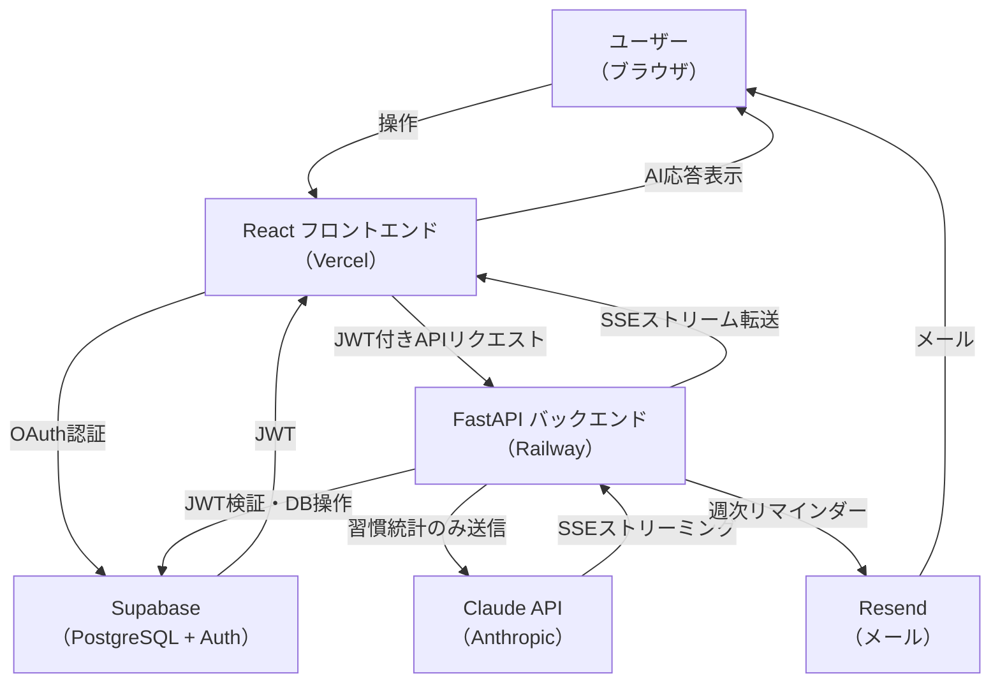
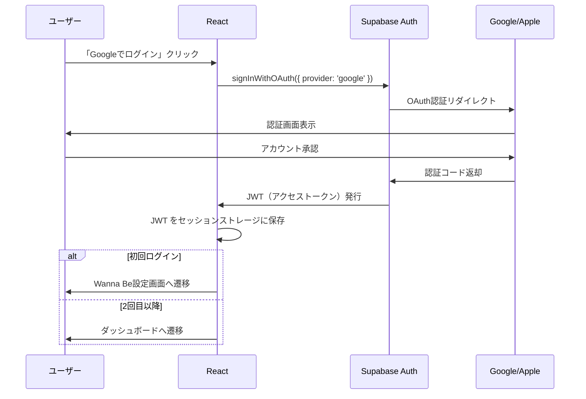
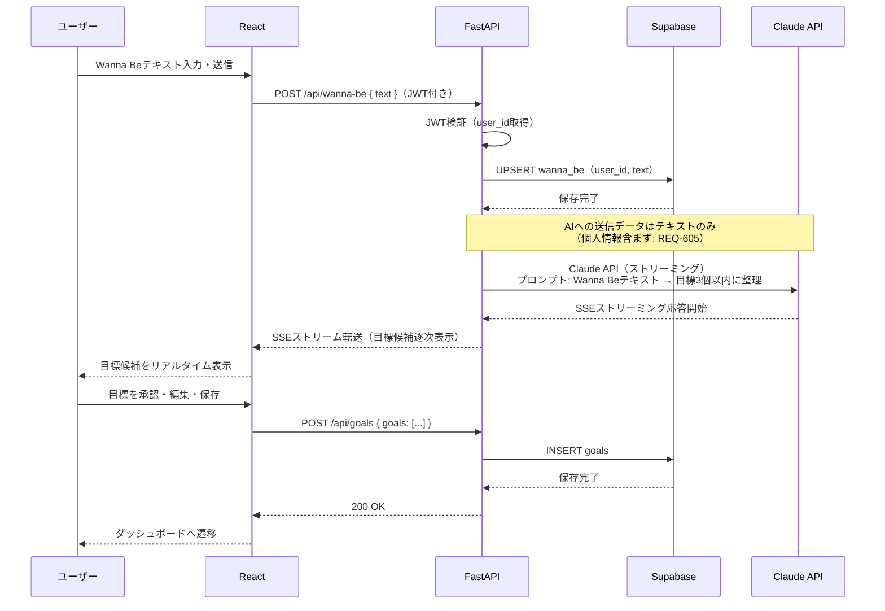
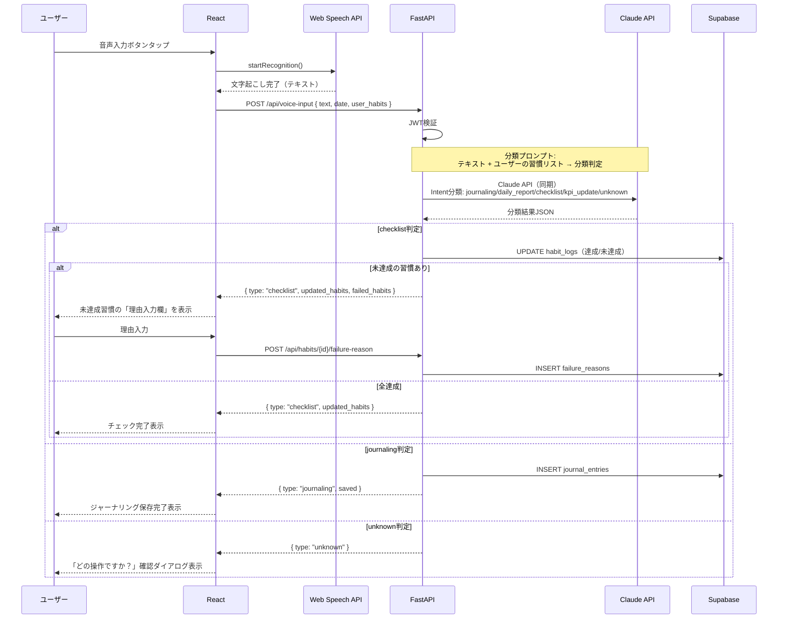
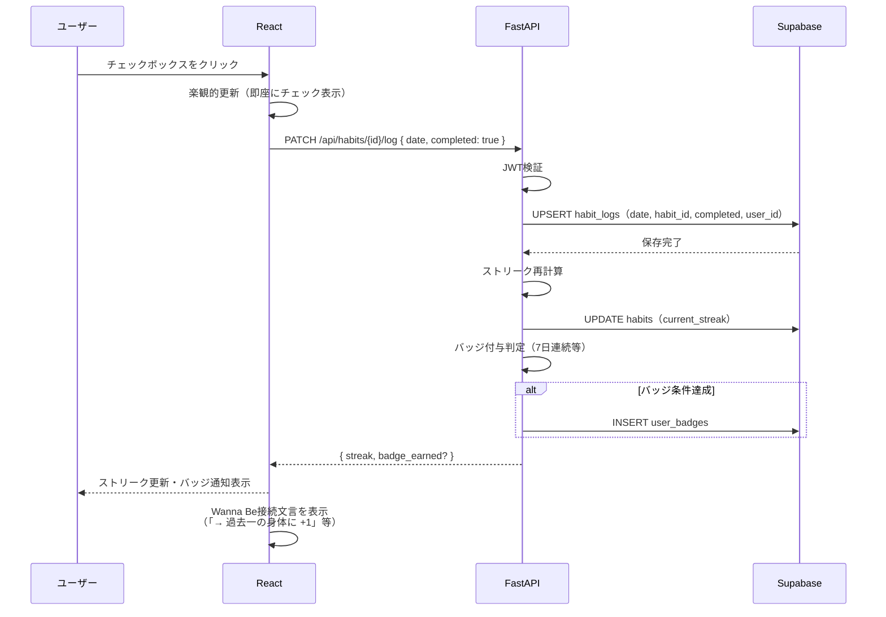
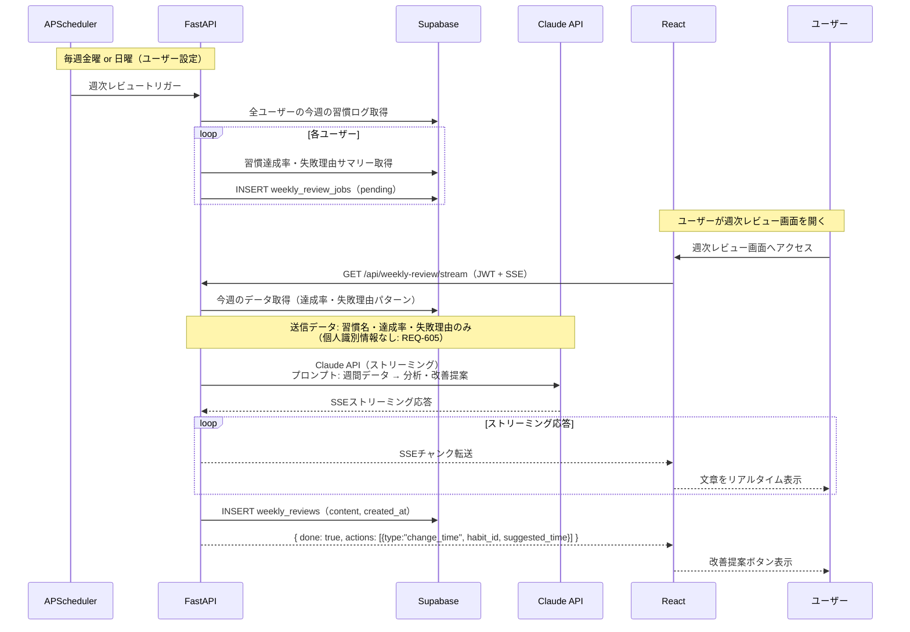
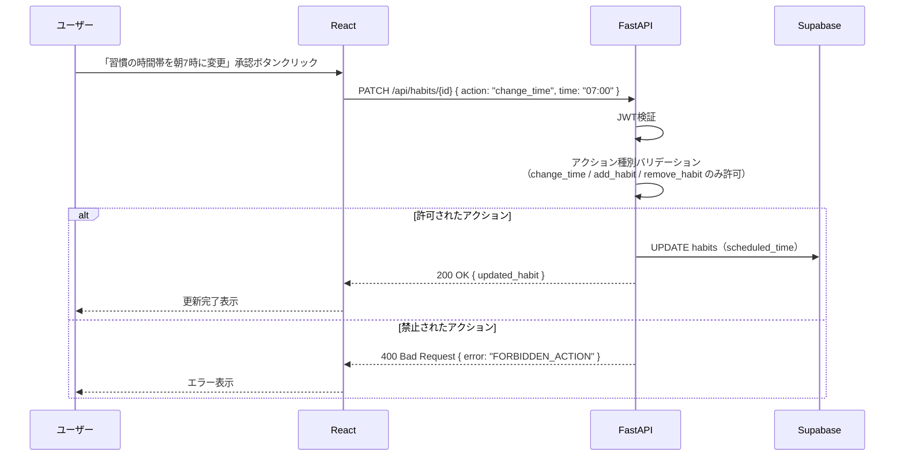
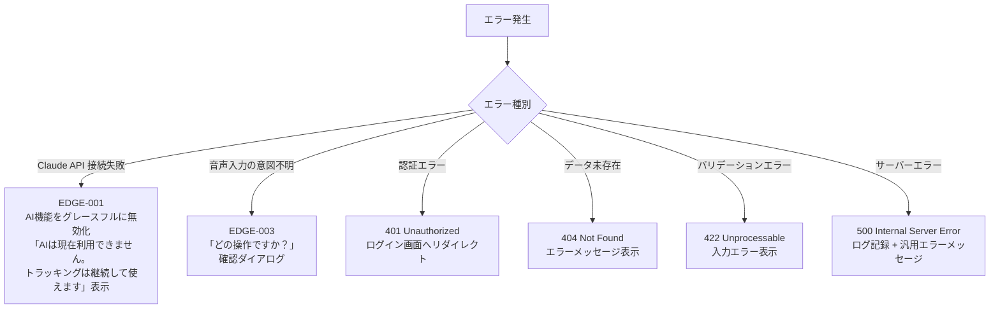
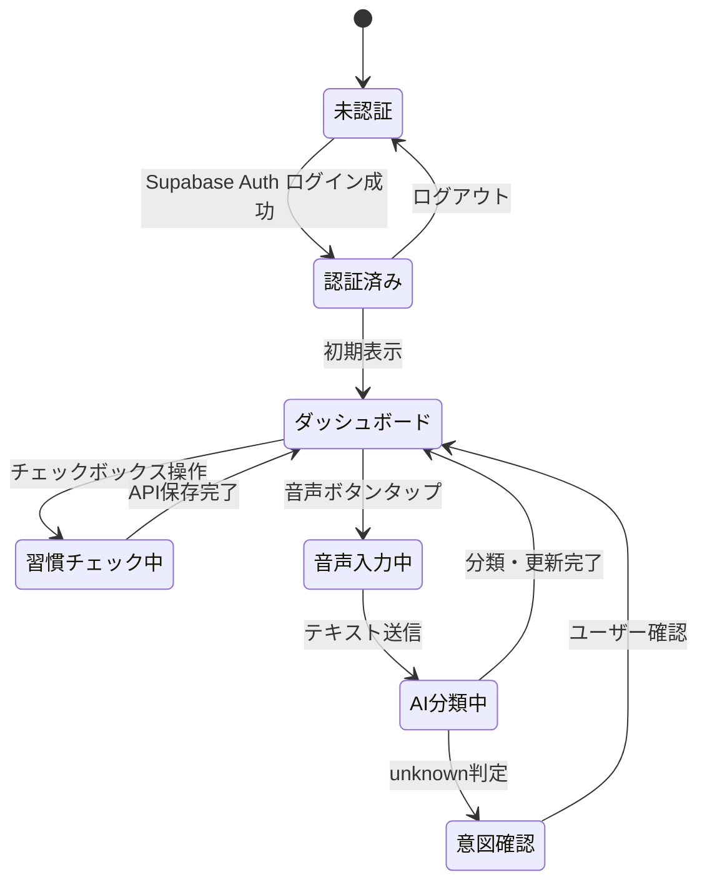
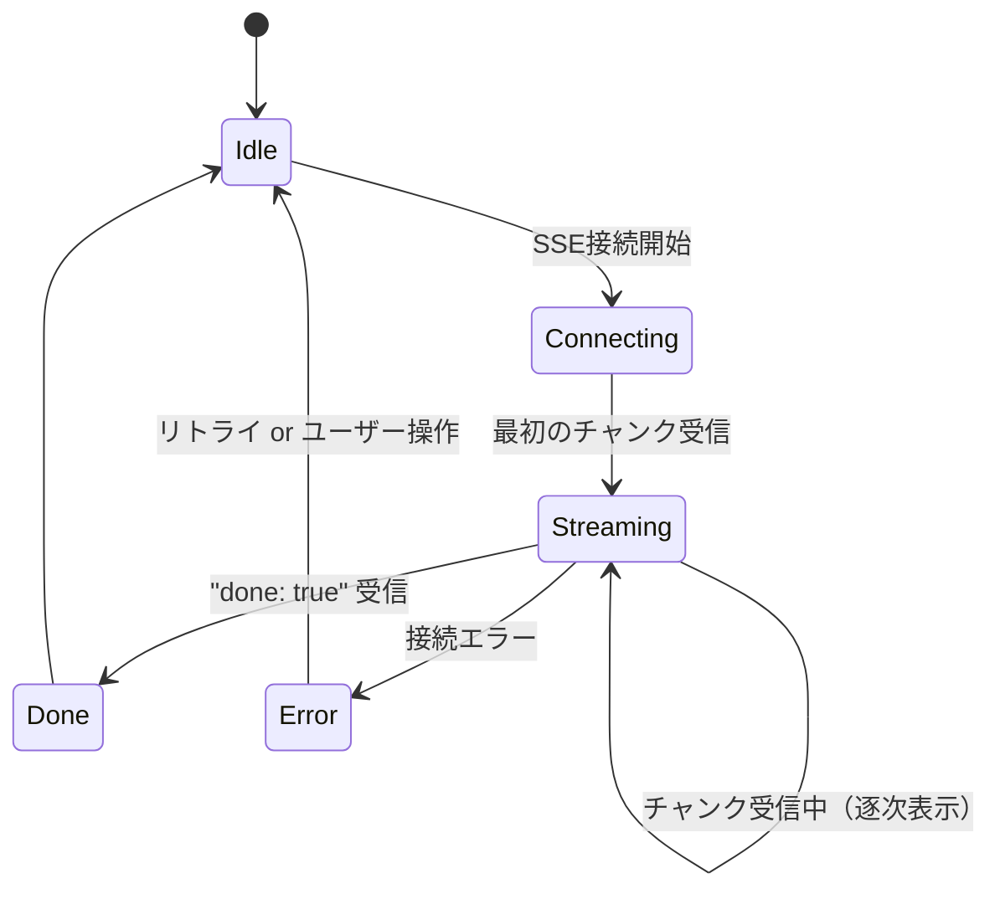

# 習慣設計アプリ データフロー図

**作成日**: 2026-04-12
**関連アーキテクチャ**: [architecture.md](architecture.md)
**関連要件定義**: [requirements.md](../../spec/habit-design-app/requirements.md)

**【信頼性レベル凡例】**:
- 🔵 **青信号**: 要件定義書・ユーザーヒアリングを参考にした確実なフロー
- 🟡 **黄信号**: 要件定義書・ユーザーヒアリングから妥当な推測によるフロー
- 🔴 **赤信号**: 要件定義書・ユーザーヒアリングにない推測によるフロー

---

## システム全体のデータフロー 🔵

**信頼性**: 🔵 *確定技術スタック・要件定義より*

---

## 主要機能のデータフロー

### 1. ソーシャルログイン 🔵

**信頼性**: 🔵 *REQ-101/102・ヒアリングQ4より*

**関連要件**: REQ-101, REQ-102, REQ-103

---

### 2. Wanna Be設定 → AI目標提案 🔵

**信頼性**: 🔵 *REQ-201/202/203・ユーザーストーリー1.2より*

**関連要件**: REQ-201, REQ-202, REQ-203, REQ-204, REQ-604, REQ-605

---

### 3. 汎用音声入力 → AI自動分類 🔵

**信頼性**: 🔵 *REQ-401/402/403・ユーザーストーリー2.2より*

**関連要件**: REQ-401, REQ-402, REQ-403, REQ-405, REQ-406

---

### 4. チェックボックスで習慣を完了登録 🔵

**信頼性**: 🔵 *REQ-404/501・ユーザーストーリー2.1より*

**関連要件**: REQ-404, REQ-501, REQ-205

---

### 5. AIコーチ週次レビュー（ストリーミング） 🔵

**信頼性**: 🔵 *REQ-601/602/701/702・ユーザーストーリー5.1より*

**関連要件**: REQ-601, REQ-602, REQ-605, REQ-701, REQ-702

---

### 6. AI提案による習慣変更（範囲制限付き） 🔵

**信頼性**: 🔵 *REQ-303・ユーザーストーリー4.1より*

**関連要件**: REQ-303, REQ-305

---

## エラーハンドリングフロー 🔵

**信頼性**: 🔵 *EDGE-001/003・NFR-101より*

---

## 状態管理フロー

### フロントエンド状態管理 🔵

**信頼性**: 🔵 *確定技術スタック（React Query + Zustand）より*

### SSEストリーミング状態 🔵

**信頼性**: 🔵 *ヒアリング技術選定Q5（ストリーミング実装）より*

---

## データ整合性の保証 🟡

**信頼性**: 🟡 *NFR要件・Supabase RLS設計から妥当な推測*

- **RLS ポリシー**: 全テーブルに `user_id = auth.uid()` 条件を設定。他ユーザーデータへのアクセスを禁止
- **楽観的更新**: チェックボックス操作は即座にUIを更新し、バックグラウンドで API を呼び出す。失敗時はロールバック
- **ストリーク整合性**: habit_logs の更新トリガーでストリーク再計算を実行（サーバーサイドで一元管理）

---

## 関連文書

- **アーキテクチャ**: [architecture.md](architecture.md)
- **型定義**: [interfaces.ts](interfaces.ts)
- **DBスキーマ**: [database-schema.sql](database-schema.sql)
- **API仕様**: [api-endpoints.md](api-endpoints.md)

## 信頼性レベルサマリー

- 🔵 青信号: 14件 (88%)
- 🟡 黄信号: 2件 (12%)
- 🔴 赤信号: 0件 (0%)

**品質評価**: 高品質
